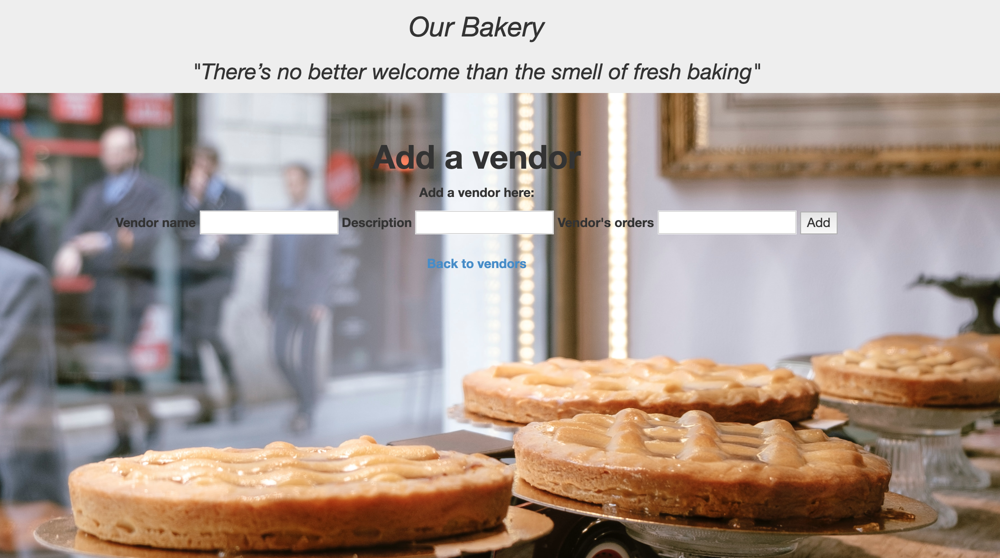

**Bakery**

**_Our Bakery"_**

A C# MVC application for a bakery.8/2/19. *By Maryana Antonyuk*

**Description**

MVC app that helps to view and manage vendors and orders online.
This Web site allows for adding new vendors, adding new orders for a given vendor, viewing vendor details and their orders, and editing vendor details. It does not allow for deleting of any vendors or orders.  

****Setup/Installation****

**Requirements**

To run this program, you have to have IDE, ex VisualStudio (I used Rider(JetBrainer)) or Terminal.

**For Terminal:**

1. Clone this repository.

2. Open the command line--I use Terminal--type 'git clone' and repository link.
At this point its a console program. In order to check its functionality you have to be in the directory of the program. 
3. Use commands mcs program.name. cs; mono in the terminal.

You will have access to all files. Enjoy!

**Known Bugs**

No known bugs.

**Technologies Used**
C#
.NET

**Support and contact details.**

Email me amaryana@gmail.com with any questions, comments, or concerns.

**License**

This software is licensed under the MIT license.

_Copyright (c) 2019 Maryana Antonyuk_

